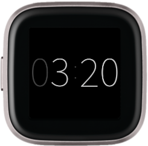

# Fitbit Pure Clock Face

Pure is a beautifully designed, highly customizable, clean, and simple clock face for Fitbit Versa devices. Featuring a large easy-to-read ⌚ time display, complete with 📅 date, 🔋 battery level, ❤ heart rate, and more.

👇 Tap to switch between the 📅 date and ⚡ activity stats

👇 Tap and ✋ hold to enable on-device ⚙ quick toggles

## Features

### Always-On Display \*

Clean and simple time display is always available

Customizable — choose the brightness of the always-on display

\* _Requires Versa 2 + FitbitOS 4.1 with AOD enabled_

### Date & Time

Easily glance at the large date and time

Customizable — choose whether to show the date, show seconds, show a leading zero for the hour, or animate (blink) the time separator

### Heart Rate

Monitor your current and resting heart rate

Customizable — choose to show your resting heart rate, or how to animate your heart rate: pulse to your heart beat, pulse at 60 BPM, or don't pulse

### Battery

Don't forget to charge your watch again

Customizable — choose to show the battery percentage

## PRO Features (requires donation)

#### Get the PRO Features!

Donate at https://pure.amod.io

Your donation gives you access to all PRO features, and supports on-going development

### Activity Stats (**PRO**)

See your steps, distance, active minutes, and calories

Animated indicators show how close you are to reaching your goals, or if you have reached them

Customizable — choose whether to show the units

### Theming (**PRO**)

Choose colors that suit your style

Customizable — choose a background and foreground accent color

### On-Device Quick Toggles (**PRO**)

Change the look and feel, right on your wrist
